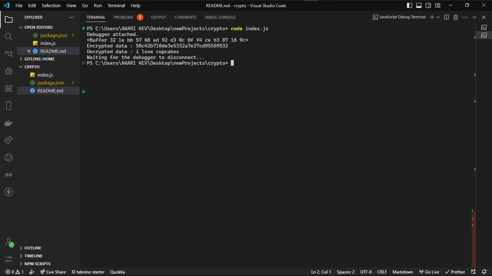

# THE NODEJS CRYPTO LIBRARY

_The Node.js crypto library is a built-in module that provides cryptographic functionality for Node.js applications. It includes a range of features, such as support for generating cryptographic keys, encrypting and decrypting data, and creating and verifying digital signatures. The Node.js crypto library uses the same cryptographicalgorithms and protocols as other secure systems, which ensures that the cryptographic operations it performs are just as secure. It also includes mechanisms for ensuring the integrity of cryptographic operations, such as support for digital signatures._

_The Node.js crypto library is easy to use and can be integrated into Node.js applications with just a few lines of code. It is widely used in the Node.js community and has become an important part of the Node.js ecosystem_

## How to use NodeJS crypto

_To start, you will need to have Node.js installed on your system. You can download the latest version of Node.js from the official website [Node Installation](<https://(https://nodejs.org/en/)>)
Once you have Node.js installed, you can use the following steps to encrypt and decrypt a message using the Node.js crypto library:_

1. Create a new Node.js project by running the following command:
   `npm init`

2. Create a new JavaScript file, named index.js, and add the following code to import the Node.js crypto library:
   `const crypto = require('crypto');`

3. Add the following code to generate a random encryption key:
   `const key = crypto.randomBytes(32);`

4. Add the following code to define the message that you want to encrypt:
   `const message = 'This is the message that we want to encrypt.';`

5. Add the following code to encrypt the message using the encryption key that you generated previously
   `const iv = crypto.randomBytes(16);`

   `const cipher = crypto.createCipheriv('aes-256-cbc', key, iv);`

   `let encrypted = cipher.update(message, 'utf8', 'hex');`

   `encrypted += cipher.final('hex');`

6. Add the following code to decrypt the encrypted message using the encryption key that you generated in step 4:
   `const decipher = crypto.createDecipheriv('aes-256-cbc', key, iv);`

   `let decrypted = decipher.update(encrypted, 'hex', 'utf8');`

   `decrypted += decipher.final('utf8');`

7. Add the following code to print the encrypted and decrypted messages to the console:
   `console.log('Encrypted message:', encrypted);`

   `console.log('Decrypted message:', decrypted);`

8. Run the following command to execute the JavaScript file and encrypt and decrypt the message:
   `node index.js`

If everything works correctly, you should see the encrypted and decrypted messages printed to the console.
Like so: 
