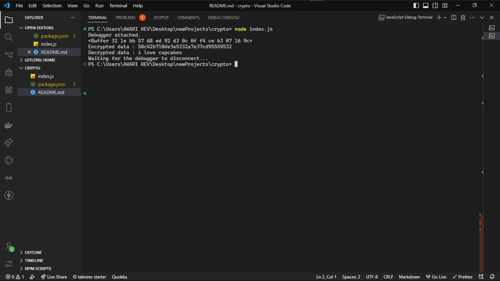
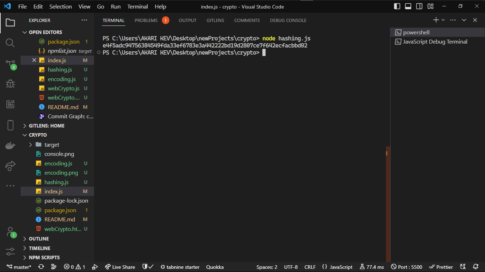
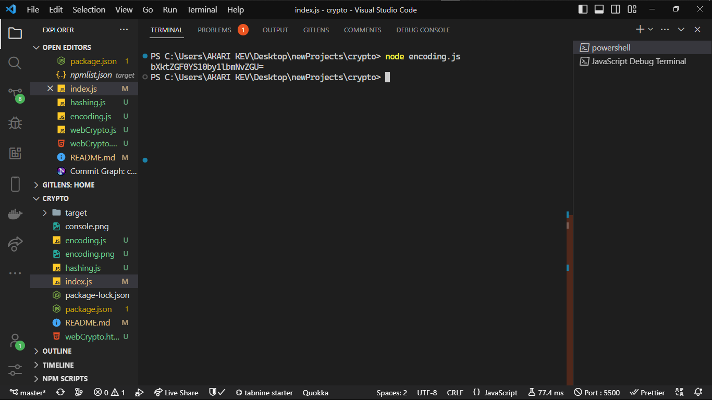
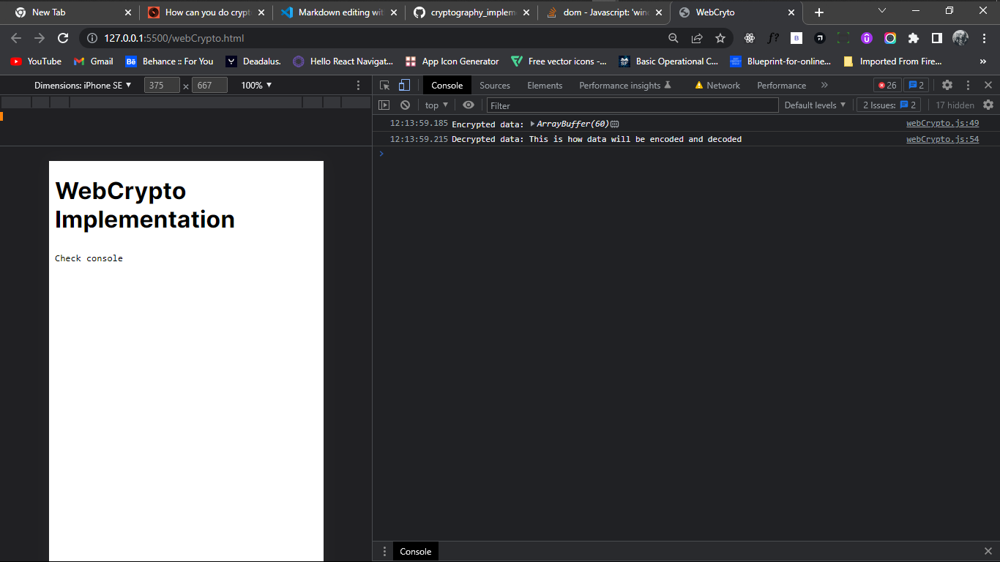

# IMPLEMENTING CRYPTOGRAPHY USING NODEJS CRYPTO LIBRARY

_The Node.js crypto library is a built-in module that provides cryptographic functionality for Node.js applications. It includes a range of features, such as support for generating cryptographic keys, encrypting and decrypting data, and creating and verifying digital signatures. The Node.js crypto library uses the same cryptographicalgorithms and protocols as other secure systems, which ensures that the cryptographic operations it performs are just as secure. It also includes mechanisms for ensuring the integrity of cryptographic operations, such as support for digital signatures._

_The Node.js crypto library is easy to use and can be integrated into Node.js applications with just a few lines of code. It is widely used in the Node.js community and has become an important part of the Node.js ecosystem_

## How to use NodeJS crypto

_To start, you will need to have Node.js installed on your system. You can download the latest version of Node.js from the official website [Node Installation](<https://(https://nodejs.org/en/)>)
Once you have Node.js installed, you can use the following steps to encrypt and decrypt a message using the Node.js crypto library:_

1. Create a new Node.js project by running the following command:
   `npm init`

2. Create a new JavaScript file, named index.js, and add the following code to import the Node.js crypto library:
   `const crypto = require('crypto');`

3. Add the following code to generate a random encryption key:

   ```javascript
   const key = crypto.randomBytes(32);
   ```

4. Add the following code to define the message that you want to encrypt:

```javascript
const message = "This is the message that we want to encrypt.";
```

5. Add the following code to encrypt the message using the encryption key that you generated previously

```javascript
const iv = crypto.randomBytes(16);

const cipher = crypto.createCipheriv("aes-256-cbc", key, iv);

let encrypted = cipher.update(message, "utf8", "hex");

encrypted += cipher.final("hex");
```

6. Add the following code to decrypt the encrypted message using the encryption key that you generated in step 4:

```javascript
const decipher = crypto.createDecipheriv("aes-256-cbc", key, iv);

let decrypted = decipher.update(encrypted, "hex", "utf8");

decrypted += decipher.final("utf8");
```

7. Add the following code to print the encrypted and decrypted messages to the console:

   ```javascript
   console.log("Encrypted message:", encrypted);

   console.log("Decrypted message:", decrypted);
   ```

8. Run the following command to execute the JavaScript file and encrypt and decrypt the message:
   `node index.js`

If everything works correctly, you should see the encrypted and decrypted messages printed to the console.
Like so: 

## Hashing and encoding

# HASHING

> Hashing is the process of taking a piece of data and converting it into a fixed-size string of characters, known as a hash. Hashes are often used to store passwords because they are secure and difficult to reverse.

**To create a hash in JavaScript, you can use the crypto library, which is built into modern browsers. Here is an example of how to create a hash using the crypto library**

```javascript
const crypto = require("crypto"); // Create a hash
const hash = crypto.createHash("sha256"); // Update the hash with the data you want to hash
hash.update("my-data-to-hash"); // Get the final hash as a hexadecimal string
const hashString = hash.digest("hex");
console.log(hashString); // Outputs a long string of characters
```

In this example, we use the sha256 algorithm to create the hash. This is a popular and secure algorithm, but there are many others to choose from. You can see a full list of supported algorithms by calling crypto.`getHashes().`


# ENCODING

> Encoding is the process of taking data and converting it into a different format. This is often used when storing or transmitting data, as different formats can be more efficient or secure.

\*_In JavaScript, you can use the Buffer class to encode data into a variety of formats. Here is an example of how to encode data as a base64 string:_

```javascript
const buffer = Buffer.from("my-data-to-encode"); // Encode the data as a base64 string
const encodedString = buffer.toString("base64");
console.log(encodedString); // Outputs a base64-encoded string
```

In this example, we use the `Buffer.from()` method to create a Buffer object storing the relevant data. Then, we instruct the Buffer to convert the data to a string in base64. From there, the encoded output is printed to the console.


## WebCrypto: On the client side

> WebCrypto is a standard for implementing cryptographic operations in web browsers. It provides a set of APIs (application programming interfaces) that enable web applications to perform cryptographic functions, such as encrypting and decrypting data, securely.

_One of the key reasons why WebCrypto makes browser cryptography secure is that it uses the same cryptographicalgorithms and protocols that are used in other secure systems. This ensures that the cryptographic operations performed by web applications are just as secure as those performed by other applications._

_Additionally, WebCrypto uses a secure environment to perform cryptographic operations. This means that the cryptographic keys used by web applications are not accessible to other parts of the browser, or to other applications on the user's device. This helps protect against attacks that try to steal cryptographic keys or other sensitive information._

_Furthermore, WebCrypto includes mechanisms for ensuring the integrity of cryptographic operations. For example, it includes support for digital signatures, which can be used to verify that a message or other data has not been tampered with. This helps protect against attacks that try to alter the results of cryptographic operations._

**Overall, WebCrypto makes browser cryptography secure by using strong cryptographicalgorithms and protocols, providing a secure environment for performing cryptographic operations, and ensuring the integrity of cryptographic operations. These features help ensure that web applications can perform cryptographic functions securely and reliably.**

#### How to use WebCrypto

**To use WebCrypto, you will need to include the crypto object in your code. This object contains several methods that you can use to perform cryptographic operations, such as generating keys, encrypting and decrypting data, and signing and verifying data.**

```javascript
// Import the WebCrypto API
const crypto = window.crypto;

// Generate a random key
async function generateKey() {
  const key = await crypto.subtle.generateKey(
    { name: "AES-GCM", length: 256 },
    true,
    ["encrypt", "decrypt"]
  );
  return key;
}

// Encrypt some data
async function encryptData() {
  const key = await generateKey();

  const data = new TextEncoder().encode(
    "This is how data will be encoded and decoded"
  );
  const iv = crypto.getRandomValues(new Uint8Array(12));
  const encryptedData = await crypto.subtle.encrypt(
    { name: "AES-GCM", iv: iv },
    key,
    data
  );

  return {
    key: key,
    iv: iv,
    encryptedData: encryptedData,
  };
}
```

1.In this example, we first import the crypto object, which provides access to the WebCrypto API. We then use the generateKey method to generate a random AES-256 key that we can use to encrypt and decrypt data.

2. Next, we create a TextEncoder object, which we can use to convert a string into a Uint8Array of bytes. We then use the encode method to encode our string as a Uint8Array.

3. Finally, we use the encrypt method to encrypt our data using the key and an initialization vector (iv). The IV is a random value that is used to ensure that the encrypted data is unique for each encryption operation.

This is just a simple example of how to use WebCrypto. There are many other cryptographic operations that can be performed using this API, such as generating hashes, signing data, and building applications that rely on client-side crypto, such as Skiff’s suite of end-to-end encrypted email and collaboration products.


# What products use cryptography in NodeJS/JavaScript?

**Crypto libraries for the web and NodeJS have enabled a new generation of privacy-first web development. A few of most used examples are below:**

##### Skiff Mail

_Skiff Mail is an end-to-end encrypted, private workspace, with products for email, calendar, collaborating on notes, and file storage. The product performs key pair generation in the web using elliptic curves. Using asymmetric cryptography, Skiff Mail encrypts messages with recipients’ public keys such that only users’ individual private keys can decrypt messages and see the resulting plain text. Skiff Mail is free to use, with 10 GB of storage included, and offers paid plans for custom domains, extra storage, and business features._

##### MetaMask

_MetaMask is a free, open-source crypto wallet. It performs all key derivation inside the app itself (which, for web users, can be a browser extension on Chrome, Firefox, or other apps), keeping a user’s secret keys stored locally. MetaMask offers extensive docs on its encryption standards, APIs, and security._

##### Password managers

_A password manager uses encryption to protect the sensitive data it stores, such as login credentials and other personal information. When a user saves a new login to the password manager, the software encrypts the data using a strong encryption algorithm. This ensures that even if someone were to gain access to the password manager's database, they would not be able to read the stored information without the proper decryption key - they would only be able to access encrypted ciphertext. The password manager also typically encrypts the user's master password, which is used to access the stored login credentials, for added security._

##### Thanks to Skiff.com for the original implementation

[skiff website](https://skiff.com/)
